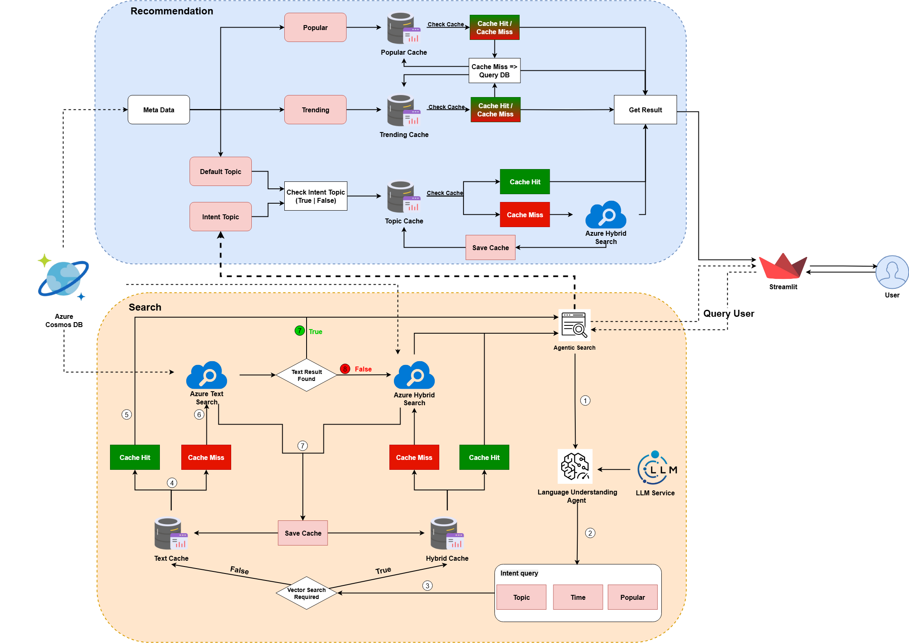

# 🚀 Code Semantic Search

## 🧠 Introduction

**Code Semantic Search** is a Python-based semantic search and recommendation pipeline that leverages large language models (LLMs) and cloud services to help users search GitHub repositories effectively. It supports full-text, vector, and hybrid search using Azure AI Search, with metadata stored in Cosmos DB. The frontend is built using **Streamlit**, enabling an interactive and user-friendly experience.

---

## 🏗️ Architecture

The following diagram illustrates the overall architecture of the Code Semantic Search system, including the flow between the user interface, LLM services, Azure AI Search, Cosmos DB, and caching layers for both search and recommendation functionalities.



---

## 📁 Project Structure

```
src/
├── api/
│   ├── app.py
│   ├── client.py
│   ├── schemas.py
│   └── test.py
├── azure_client/
│   ├── filter/
│   │   └── llm_generate_related_filters.py
│   ├── azure_recommend.py
│   ├── azure_search.py
│   ├── boosted_score.py
│   └── config.py
├── llm/
│   ├── client.py
│   ├── llm_helpers.py
│   └── utils.py
├── streamlit_client/
│   ├── page/
│   │   ├── main_page.py
│   │   ├── recommendation_page.py
│   │   └── search_page.py
│   ├── client.py
│   └── utils.py
requirements.txt
.env
```

---

## ✨ Key Features

### 🔍 1. Search Page

- Supports **full-text**, **vector**, and **hybrid search** modes using Azure AI Search.
- Understands natural language queries via **LLM** (Groq / Gemini / OpenAI).
- Automatically generates **metadata filters**, **related queries**, and **sorting options** using LLMs.
- Streamlit-based UI for real-time interaction.

**How to Use:**

```
- Enter your query in the search bar.
- Submit to trigger a search.
- Click on generated filters or related queries to refine your results.
```

---

### 📈 2. Recommendation Page

- Trending repositories by **stars or recency**.
- Popular repositories based on stars.
- Topic-based suggestions using default or dynamically generated topics.

**How to Use:**

```
- Navigate to the recommendation page to explore relevant repositories without searching manually.
```

---

### ⚖ 3. Ranking & Scoring

- Custom algorithm:

```
final_score = search_score * 0.8 + (stars / number_of_days_since_created) * 0.2
```

---

### 🤖 4. LLM Enhancements

- Extract query intent, generate semantic filters, and improve results using **Groq/Gemini**.

---

## ⚙ Getting Started

### ✅ Prerequisites

- Python 3.12+
- Azure Subscription (AI Search + Cosmos DB)
- Streamlit
- API keys (OpenAI, Google/Gemini, or Groq)

---

### 💾 Installation

```bash
git clone <your-repo-url>
cd code-semantic-search
python -m venv venv
source venv/bin/activate       # Windows: venv\Scripts\activate
pip install -r requirements.txt
```

---

### 🚀 Running the Application

**1. Start the backend API:**

```bash
cd src/api
python -m uvicorn app:app --host 0.0.0.0 --port 8080 --reload --reload-dir ..
```

**2. Open a new terminal & launch the Streamlit frontend:**

```bash
cd src/streamlit_client
streamlit run client.py
```

---

## 🔐 Configuration

Add the following to your `.env` file:

```
GOOGLE_API_KEY=your-google-api-key  
GEMINI_API_KEY=your-gemini-api-key  
GROQ_API_KEY=your-groq-api-key  

AZURE_AI_SEARCH_KEY=your-azure-ai-search-key  
AZURE_AI_SEARCH_ENDPOINT=https://your-search-endpoint  
AZURE_AI_SEARCH_INDEX=cosmosdb-index  
AZURE_AI_SEARCH_GITHUB=github-example-index  

COSMOS_DB_KEY=your-cosmos-db-key  
```

